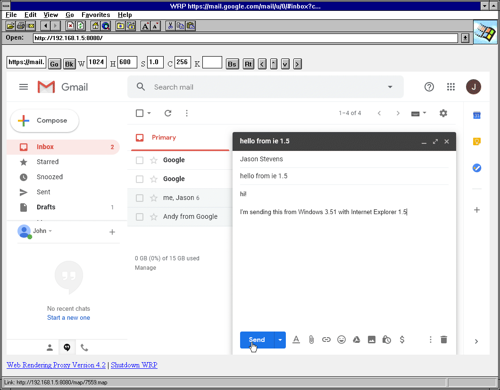

# WRP - Web Rendering Proxy

A HTTP proxy server that allows to use historical and obsolete web browsers on the modern web. It works by rendering the web page in to a GIF image associated with clickable imagemap of original web links.

## Current Status

* This is the new GoLang/ChdomeDP version.
* It's still lacking some features of the [older version](/old) (such as real http proxy mode and image manipulation) but far surpasses it in terms of stability and usability. 
* Currently works as browser-in-browser however work on http proxy mode is under way.
* It's beta quality but I can actually fix and maintain the code.

## Usage	

1. [Download a WRP binary](https://github.com/tenox7/wrp/releases) and run on a  server/gateway. 	
2. Point your legacy browser to the IP address:port of WRP server.	
3. Type a search string or a http/https URL and click Go.	
4. Adjust your screen width/height/scale to fit in your old browser.	
5. For very very very old browsers such as Mosaic 2.x and IBM WebExplorer 1.x check the I checkbox to enable ISMAP mode. However this normally should not be needed.	
6. Scroll web page by clicking Up/Down. To go to top enter 0 and click Go.



## Flags
```
-l  listen address:port, default :8080
-h  headed mode, display browser window
-d  chromedp debug logging
```

## More info and screenshots
* http://virtuallyfun.superglobalmegacorp.com/2014/03/11/web-rendering-proxy-update/
* http://virtuallyfun.superglobalmegacorp.com/2014/03/03/surfing-modern-web-with-ancient-browsers/
